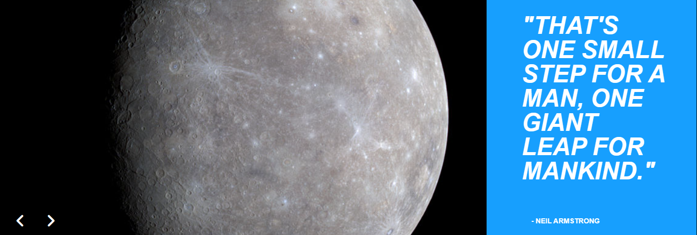

<h1>Memoria del proyecto fin de evaluación de Lenguajes de Marcas - 1º DAW</h1>
<h2>Solay-System | Hisui</h2>
<h2>Indice</h2>
<ul>
  <li><a href="#introduccion">Introducción</a></li>
  <li><a href="#motivacion">Motivación</a></li>
  <li><a href="#estructura">Estructura</a></li>
  <li><a href="#estilo">Estilo</a></li>
</ul>

<h2 id="introduccion">Introducción</h2>

Trabajo realizado en clase por: Álvaro Leiva García

Proyecto de web "from scratch" de 1ª evaluación de Lenguajes de Marcas

Diciembre de 2023 

Licencia CC-BY

<h2 id="motivacion">Motivación</h2>

El tema lo he elegido porque desde pequeño me ha apasionado el espacio y todo lo relacionado con el mismo, pero nunca fui bueno eligiendo temas para trabajos o exposiciones, aun así tuve la suerte de encontrarme un vídeo de Youtube con un comienzo de animación del sistema solar estilo minimalista que me gustó mucho, lo que me motivó a terminarla y modificarla a mi gusto para centrar la temática de mi página en ella.

<h2 id="estructura">Estructura</h2>

La web está dividida en  6 secciones:

<ul>
  <li>Hero Section</li>  
  <li>Planetas</li>
  <li>Imágenes</li>
  <li>Historia</li>
  <li>Ubicación</li>
  <li>Footer</li>
</ul>

<h3>Hero Section</h3>

He utilizado una animación del Sol junto a tres planetas orbitándole, se adapta a diversos dispositivos móviles colocándose en vertical y ocultando los planetas exteriores 
Sobre ella he colocado un Call to Action que añade una animación de hover 

<h3>Introducción</h3>

He dispuesto en un grid de columnas, cuya cantidad dependerá del ancho de la página, cada uno con una card que incluye una imagen del planeta a tratar, su nombre y una breve explicación

<h3>Galería</h3>

He optado por utilizar un slideshow de imágenes, el cual fue necesario retocar en varios aspectos a nivel de estilo fundamentalmente para adaptarse a mis necesidades

<h3>Historia</h3>

He utilizado un acordeón con preguntas y respuestas sobre la historia del Sistema Solar

<h3>Ubicación</h3>

Se muestra una imagen que señala la posición del Sistema Solar en la Vía Láctea junto a un breve texto explanatorio

<h3>Footer</h3>

He usado un grid de 3 columnas con enlaces a los elementos de la página, enlaces a redes sociales (no funcionales) y datos sobre mi y la página genéricos

<h2 id="estilo">Estilo de la página</h2>
<h3>Paleta de colores</h3>

.....

<h3>Tipografías</h3>

.....

<h3>Imágenes</h3>

.....

<h3>Videos</h3>

.....

...................
<h2 id="snippets">Code snippets</h2>

He utilizado los siguientes:

<ul>
  <li>Fondo de la Hero Section: https://www.youtube.com/watch?v=20R6lVROuNk&t=3s</li>
  <li>Slideshow de imágenes: https://www.codehim.com/carousel/javascript-quotes-slideshow-with-images/</li>
</ul>
